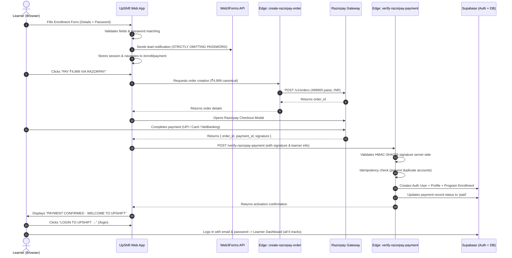

# UpShift Complete Program: Final Enrollment + Razorpay Payment Flow

## Overview
Successfully implemented the complete production enrollment and payment architecture for UpShift by The AI School. The new flow transitions public applicants from the enrollment form directly into the dedicated payment experience, executing official Razorpay checkout for ₹4,999 (one-time enrollment including all 6 applied AI tracks), with cryptographic server-side payment verification, idempotent Supabase Auth account creation, and seamless login routing.

---

## 1. Files Changed & Created

### Database & Migrations
- `supabase/migrations/005_payment_flow_and_razorpay.sql`: Added `public.payments` table, indexes, and RLS policies for tracking checkout orders, payments, and receipts.

### Supabase Edge Functions (Server-Side)
- `supabase/functions/create-razorpay-order/index.ts`: Creates canonical ₹4,999 (499900 paise, INR) order via Razorpay API and logs initial order attempt.
- `supabase/functions/verify-razorpay-payment/index.ts`: Verifies Razorpay HMAC SHA-256 signature, validates canonical payment amount & currency, performs idempotency checks, provisions/activates Supabase Auth user, creates profile and UpShift Complete Program enrollment, and records verified payment status.

### Frontend Application
- `src/services/paymentService.js`: Dynamic Razorpay SDK loader, order initialization, and verification helper service.
- `src/pages/enroll/EnrollmentPage.jsx`: Full categorized enrollment form collecting personal info, academic background, focus track, and password credentials with client-side validation and Web3Forms lead notification.
- `src/pages/enroll/PaymentPage.jsx`: Dedicated payment page showing program summary, all 6 included tracks, confirmed learner information, and official Razorpay checkout integration with real-time verification and success/failure screens.
- `src/components/UpShiftRegistrationModal.jsx`: Synchronized modal enrollment flow redirecting seamlessly to `/enroll/payment`.
- `src/components/Navbar.jsx`: Added prominent `ENROLL` and `LOGIN` actions across desktop and mobile.
- `src/App.jsx`: Registered public `/enroll` and `/enroll/payment` routes.
- `.env.example`: Updated environment template with placeholders for client keys and server-side secrets.
- `.env.local`: Added `VITE_RAZORPAY_KEY_ID` placeholder.

---

## 2. Commercial & Security Architecture

---

## 3. Verification & Build
- `npm run build`: **PASSED with 0 errors**.
- All 6 courses remain intact and accessible to enrolled learners.
- Existing admin workflow and existing learner accounts remain fully supported.
